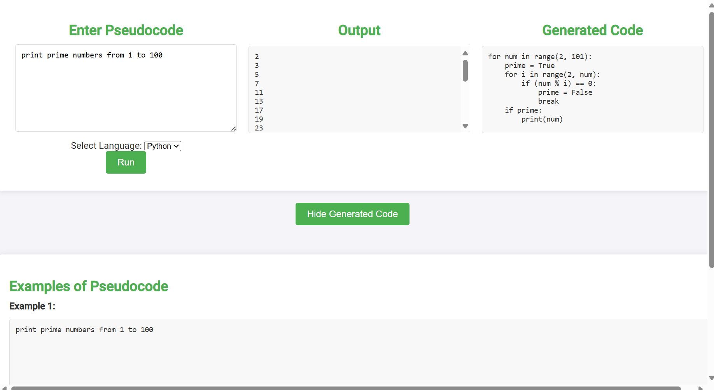

# PseudoCoder

**PseudoCoder** is a web application that converts pseudocode into Python or C++, executes the generated code under the hood, and displays the output. This tool is perfect for students, educators, and developers who want to quickly test and run their pseudocode without manual translation.

## Screenshot



## Features

- Convert pseudocode to Python or C++
- Execute the code and display the output
- View the generated code
- Examples of pseudocode provided for quick reference

## Installation

1. Clone the repository:
   ```sh
   git clone https://github.com/kaistermaister1/PseudoCoder.git
   ```
2. Navigate to the project directory:
   ```sh
   cd PseudoCoder
   ```
3. Install the required dependencies:
   ```sh
   pip install -r requirements.txt
   ```

4. Add your API key:
   Open the `app.py` file and enter your API key at the designated location.
   ```python
   # Example:
   client = OpenAI(api_key='enter API key here',)
   ```

5. Run the application:
   ```sh
   python app.py
   ```

## Usage

1. Open your web browser and go to `http://localhost:5000`.
2. Enter your pseudocode in the text area.
3. Select the target programming language (Python or C++).
4. Click the "Run" button to see the output and the generated code.

## Project Structure

- `app.py`: The main application file that handles backend logic.
- `static/`
  - `css/`
    - `style.css`: CSS file for styling the application.
  - `js/`
    - `script.js`: JavaScript file to handle front-end logic.
- `templates/`
  - `index.html`: The front-end interface for user interaction.
- `README.md`: Project description and instructions.
- `requirements.txt`: File listing the project dependencies.

## Example Pseudocode

### Example 1:
```
print prime numbers from 1 to 100
```

### Example 2:
```
def is-palindrome:
    ignore spaces and punctuation
    for pos in string:
       if string[-pos] is not equal string[pos]: false
     true

is-palindrome('race car') should be true
is-palindrome('foobaroof') should be false
```

## License

This project is licensed under the MIT License - see the [LICENSE](LICENSE) file for details.